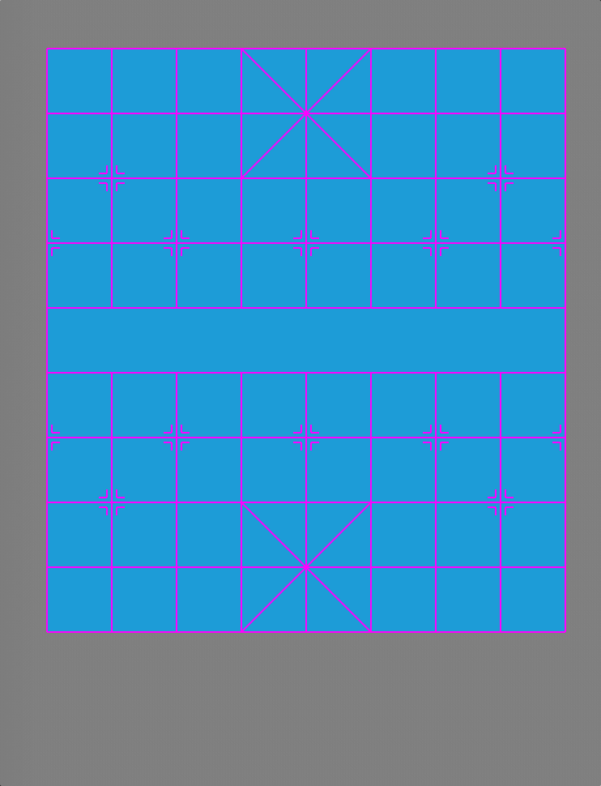
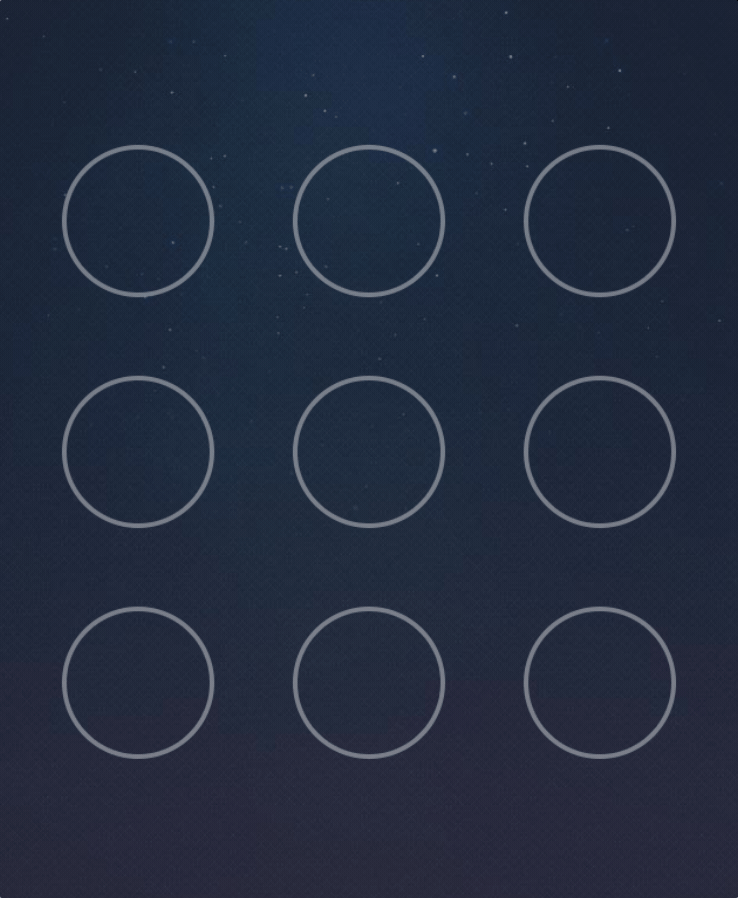
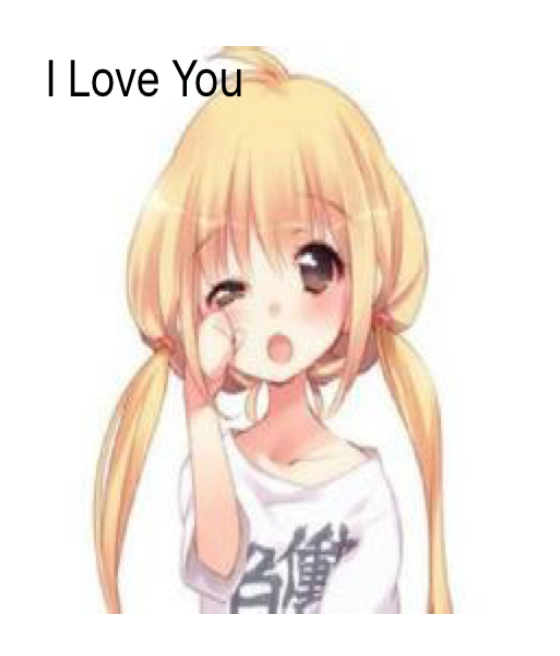
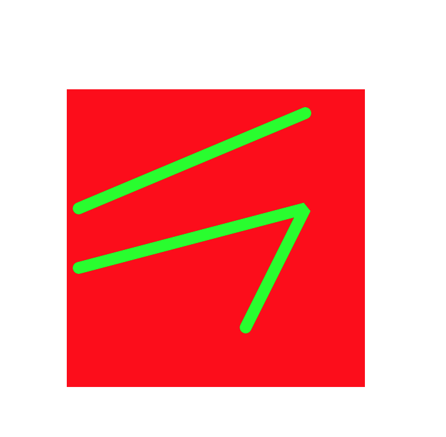
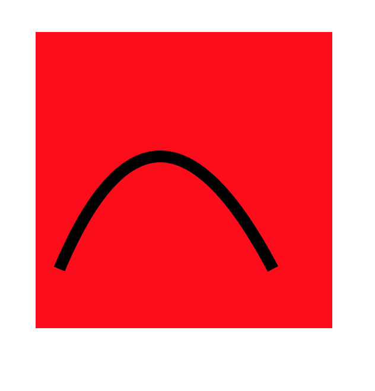
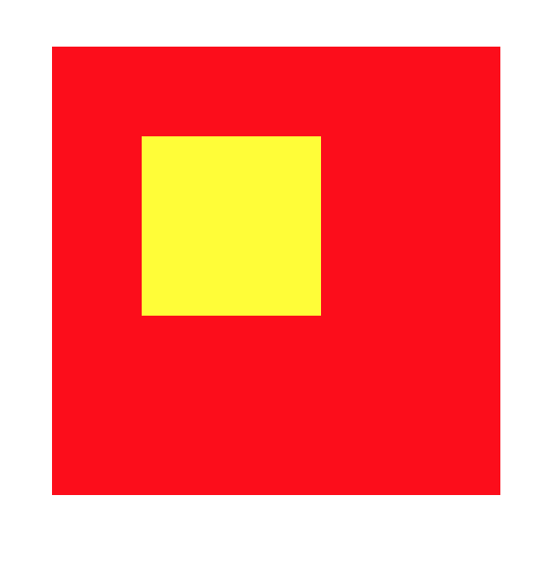
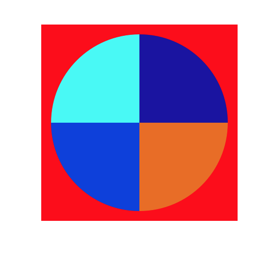

# GestureLock
这里面还有用Quartz2d做的棋盘，还有自定义Segue的知识。
## 相关资源
[棋盘和手势解锁](https://github.com/XinYiheng/GestureLock.git)
> 

> 


[GitHub粒子发射和复制图层示例](https://github.com/XinYiheng/CAEmitterLayerAndCAReplicatorLayer.git)

[GitHub粘性控件示例](https://github.com/XinYiheng/StickyMessageView.git)

[GitHub弹性动画](https://github.com/XinYiheng/CastAndFurlAnimation.git)

[CALayer分析](http://www.jianshu.com/p/a065525f0e61)

[响应者手势分析](http://www.jianshu.com/p/0640f5e2998c)

[CAEmitter分析](http://www.jianshu.com/p/aaa798e9c194)

# Quartz2D
> Quartz2D是一个二维绘图引擎，同时支持iOS和Mac系统。iOS中，大部分控件都是Quartz2D绘制出来的。这里需要重点说明一下，Quartz2D的接口（函数）和使用对象（或者结构体）定义在CoreGraphics框架和UIKit中。一般情况下我们使用UIKit下面提供的对象和接口就可以实现丰富的功能。复杂的情况下需要混合使用，或者只使用CoreGraphics框架。CoreGraphics是C语言框架，使用起来不如面向对象方便。

## 图形上下文
> 提到绘图，我们就得了解最基本的概念。图形上下文所表示的是图形绘制的平台。包含绘制参数以及需要执行一系列绘图命令的设备信息。图形上下文定义了包括绘制颜色、裁剪区域、曲线宽度以及绘制模式信息、文本字体信息、一些合成选项或者是一些其他的有关绘制的基本属性。看下图，了解一下上下文的分类：
> 
> 
> 这里主要分析和用到了两种上下文：


## 1. Bitmap Graphics Context

 > 位图上下文，在这个上下文上绘制或者渲染的内容，可以获取成图片（需要主动开启一个上下文来使用，使用完毕，一定要销毁或者关闭；所以这里也不需要在UIView 的 drawRect:方法里获取上下文了）。
 
### 开启和关闭上下文
 
 ```
 // 开启一个图片（位图）上下文//size:上下文尺寸，opaque:不透明度，scale:如果设置为0.0，这个设置是屏幕的scale，例如iPhone6是2，iPhone6P是3。
 UIGraphicsBeginImageContextWithOptions(CGSize size, BOOL opaque, CGFloat scale);
 // 关闭位图上下文
 UIGraphicsEndImageContext();
 
 ```
 
### 简单示例

1. 打水印

   ```
    UIImage *image = [UIImage imageNamed:@"卡哇伊"];
    UIGraphicsBeginImageContextWithOptions(image.size, NO, 0.0);
    //把图片给绘制图片上下文.
    [image drawAtPoint:CGPointZero];
    //绘制文字
    NSString *str = @"I Love You";
    [str drawAtPoint:CGPointZero withAttributes:@{NSFontAttributeName : [UIFont systemFontOfSize:20]}];
    //生成图片
    UIImage *newImage = UIGraphicsGetImageFromCurrentImageContext();
    //手动关闭上下文
    UIGraphicsEndImageContext();

    self.imageV.image = newImage;

 ```
 >  
 
2. 擦图

 ```
 - (void)viewDidLoad {
    [super viewDidLoad];
    // Do any additional setup after loading the view, typically from a nib.
    self.imageV.userInteractionEnabled = YES;
    //添加手势
    UIPanGestureRecognizer *pan = [[UIPanGestureRecognizer alloc] initWithTarget:self action:@selector(pan:)];
    [self.imageV addGestureRecognizer:pan];
}

  - (void)pan:(UIPanGestureRecognizer *)pan{

    //获取当前手指所在的点
    CGPoint curP = [pan locationInView:self.imageV];
    CGFloat rectWH = 50;
    CGFloat x = curP.x - rectWH * 0.5;
    CGFloat y = curP.y - rectWH * 0.5;
    CGRect rect =   CGRectMake(x, y, rectWH, rectWH);
    
    //开启一个图片上下文.
    UIGraphicsBeginImageContextWithOptions(self.imageV.bounds.size, NO, 0);
    
    //获取当前的上下文.
    CGContextRef ctx = UIGraphicsGetCurrentContext();
    
    //把UImageViwe上面的图片给绘制到上下文.
    [self.imageV.layer renderInContext:ctx];
    
    //确定擦除区域
    CGContextClearRect(ctx, rect);
    
    //生成一张新图片
    UIImage *newImage = UIGraphicsGetImageFromCurrentImageContext();
    
    //把上下文给关闭
    UIGraphicsEndImageContext();
    //给原来图片重新赋值
    self.imageV.image = newImage;

  }
 ```
  >  
  
3. 截屏

	```
	//1.开启图片上下文.
    UIGraphicsBeginImageContextWithOptions(self.view.bounds.size, NO, 0);
    
    //获取当前的上下文.
    CGContextRef ctx =  UIGraphicsGetCurrentContext();
    
    //UIView之所能够显示,是因为layer.把层渲染给位图上下文.
    [self.view.layer renderInContext:ctx];
    
    //生成一张图片.
    UIImage *newImage = UIGraphicsGetImageFromCurrentImageContext();
    
    //如何把图片转换成二进流.
    NSData *data = UIImagePNGRepresentation(newImage);
    [data writeToFile:@"/Users/Boat/Desktop/newImage.png" atomically:YES];
    
    //关闭上下文.
    UIGraphicsEndImageContext();
    
	```
 
## 2. Layer Graphics Context 
 
 > 图层上下文，针对UI控件的上下文。我们已经很清楚，view之所以能显示内容，全靠layer（图层）。
 
### UIView 的 drawRect:方法
> drawRect: 这个是UIKit提供给UIView的方法，只有在此方法中我们才可以获取到与此View对象对应的图层上下文（CGContextRef）；但是有时候我们在想，苹果为什么不直接给CALayer提供此方法呢？可能是我才疏学浅，毕竟QuartsCore也给我们提供了各种类型的layer，也许我们需要挖掘一下QuartsCore下面的CALayer。详情请参考顶部的*相关资源*。

### 基本绘图
> 先通过基本绘图，我们可以总结用法以及原理。

1. 简单直线

  ```
// Drawing code
    NSLog(@"%s",__func__);
    NSLog(@"%@",NSStringFromCGRect(self.bounds));
    
    //1.取得一个跟View相关联的上下文.
    CGContextRef ctx = UIGraphicsGetCurrentContext();
    //2.描述路径
    UIBezierPath *path = [UIBezierPath bezierPath];
    //2.1.设置起点
    [path moveToPoint:CGPointMake(10, 100)];
    //2.1.添加一根线到某个点
    [path addLineToPoint:CGPointMake(200, 20)];
    
    //一个路径上面可以画多条线
    [path moveToPoint:CGPointMake(10, 150)];
    [path addLineToPoint:CGPointMake(200, 100)];
    
    //把上一条线的终点当作是下一条线的起点.
    [path addLineToPoint:CGPointMake(150, 200)];
    
    
    //设置上下文的状态
    //设置线的宽度
    CGContextSetLineWidth(ctx, 10);
    //设置线的连接样式
    CGContextSetLineJoin(ctx, kCGLineJoinBevel);
    //设置顶角的样式
    CGContextSetLineCap(ctx, kCGLineCapRound);
    //设置线的颜色
    [[UIColor greenColor] setStroke];
    
    
    //3.把路径添加到上下文
    CGContextAddPath(ctx, path.CGPath);
    //4.把上下文的内容显示View fill stroke
    CGContextStrokePath(ctx);

 ```
 >  

2. 简单曲线
  
  ```
  //1.获取跟View相关联的上下文
    CGContextRef ctx =  UIGraphicsGetCurrentContext();
    //2.描述路径
    UIBezierPath *path = [UIBezierPath bezierPath];
    //2.1设置起点
    [path moveToPoint:CGPointMake(20, 200)];
    //2.2添加一条曲线到某个点.
    [path addQuadCurveToPoint:CGPointMake(200, 200) controlPoint:CGPointMake(100, 10)];
    
    CGContextSetLineWidth(ctx, 10);
    
    //3.把路径添加到上下文
    CGContextAddPath(ctx, path.CGPath);
    //4.把上下文的内容显示出来.
    CGContextStrokePath(ctx);
  ```
> 

3. 简单矩形

  ```
  //1.获取上下文
    CGContextRef ctx = UIGraphicsGetCurrentContext();
    //2.描述路径
    UIBezierPath *path = [UIBezierPath bezierPathWithRect:CGRectMake(50, 50, 100, 100)];
    //3.把路径添加到上下文
    CGContextAddPath(ctx, path.CGPath);
    
    [[UIColor yellowColor] set];
    
    //4.把上下文的内容显示
    CGContextFillPath(ctx);
  ```
  > 
  
4. 简单饼图
  
  ```
  NSArray *dataArray =  @[@25,@25,@25,@25];
    
    //画饼图扇形
    CGPoint center = CGPointMake(rect.size.width * 0.5, rect.size.height * 0.5);
    CGFloat radius = rect.size.width * 0.5 - 10;
    CGFloat startA = 0;
    CGFloat angle = 0;
    CGFloat endA = 0;

    for (NSNumber *num in dataArray) {
        startA = endA;
        angle = num.intValue / 100.0 * M_PI * 2;
        endA = startA + angle;
       UIBezierPath  *path = [UIBezierPath bezierPathWithArcCenter:center radius:radius startAngle:startA endAngle:endA clockwise:YES];
        [path addLineToPoint:center];
        [[self randomColor] set];
        [path fill];
    }
//随机生成一个颜色
- (UIColor *)randomColor{
    
    CGFloat r = arc4random_uniform(256) / 255.0;
    CGFloat g = arc4random_uniform(256) / 255.0;
    CGFloat b = arc4random_uniform(256) / 255.0;

    //0-255.
//    colorWithRed  0-1
   return [UIColor colorWithRed:r green:g blue:b alpha:1];
}
  ```
  > 
  
  
> 现在基本可以总结
> 
> 1. 获得上下文
> 
> 2. 绘制/拼接绘图路径
> 
> 3. 上下文当前栈设置，包括颜色，线条等
> 
> 4. 将路径添加到上下文
> 
> 5. 渲染上下文
> 
> Note:
> 
> 这里使用的是UIKit下面的贝塞尔曲线类，没用使用CoreGraphics的路径。
> 
> UIBezierPath包含很多对CoreGraphics的路径（Path）的封装，而且还提供直接渲染功能，当然还包括对图形上下文栈（CGContextRestoreGState）的封装。
> 
> 对于图形上下文栈（CGContextRestoreGState）这里不做说明，请去站内搜索。


### UIKit对象直接绘图
> 注意，这里介绍的仍然是图层上下文（Layer Graphics Context）。这里相关知识不再介绍，也不再配图。有兴趣可以试一试。

1. 图片UIImage对象相关

 ```
 - (void)drawRect:(CGRect)rect {
    // Drawing code
    
    //1.加载图片
    UIImage *image = [UIImage imageNamed:@"001"];
    
    //2.绘制出来的图片,是保持原来图片
    // [image drawAtPoint:CGPointZero];
    //2. 把图片填充到这个rect当中.
    [image drawInRect:rect];
    // 添加裁剪区域 .把超区裁剪区域以外都裁剪掉
    UIRectClip(CGRectMake(0, 0, 50, 50));
    // [image drawAsPatternInRect:self.bounds];

 }
 
 ```

2. 文字NSSting相关

 ```
NSString *str = @"辛为舟帅气侧漏";
    
    //AtPoint:文字所画的位置
    //withAttributes:描述文字的属性.
    NSMutableDictionary *dict = [NSMutableDictionary dictionary];
    //设置文字大小
    dict[NSFontAttributeName] = [UIFont systemFontOfSize:50];
    
    //设置文字颜色
    dict[NSForegroundColorAttributeName] = [UIColor greenColor];
    //设置描边宽度
    dict[NSStrokeWidthAttributeName] = @2;
    //设置描边颜色
    dict[NSStrokeColorAttributeName] = [UIColor blueColor];

    
    //设置阴影
    NSShadow *shadow = [[NSShadow alloc] init];
    //设置阴影的便宜量
    shadow.shadowOffset = CGSizeMake(10, 10);
    //设置阴影颜色
    shadow.shadowColor = [UIColor greenColor];
    //设置阴影模糊程序
    shadow.shadowBlurRadius = 1;
    dict[NSShadowAttributeName] = shadow;
    //不会自动换行
    [str drawAtPoint:CGPointZero withAttributes:dict];
    //会自动换行.
    [str drawInRect:self.bounds withAttributes:dict];
    
 ```
 
 
 
